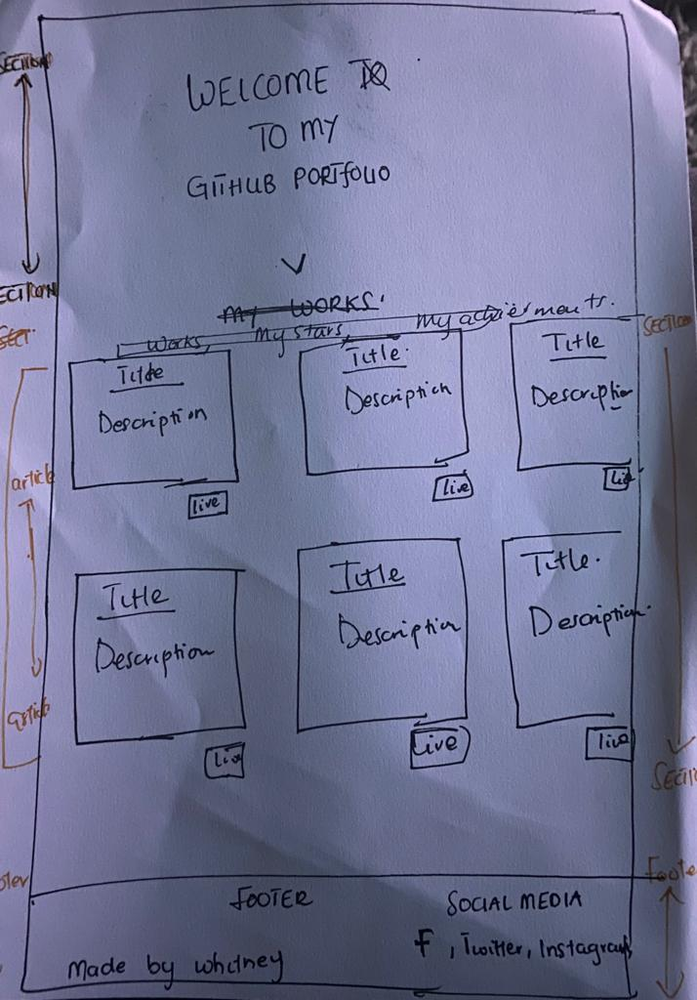

# PORTFOLIO FOR GITHUB 
 

 ## Project 

This project has been assigned to us by the school with the objective of creating a portfolio for GitHub. The project entails the utilization of skills acquired during the recent course, where we are expected to apply these skills to our project. The portfolio to be created will provide an overview of my GitHub profile, including all the projects I have starred and my repositories. It is mandatory for the portfolio to be designed as a single page.

## Requirement list 

- Retrieve data from API.
- Develop portfolio as a Single Page Application with routing (frameworks can be used).
- Provide thorough documentation of the project.
- Document features, functionalities, and technical aspects of the application.

## Ideas and drawings
My idea is very simple. The portfolio begins with a landing page that welcomes the user or viewer to the page. On the same page the user gets directed with an arrow facing down to projects made by me in github.The user can navigate through the menu. The menu contains, my overview, starred projects , achievements and repositories. The footer will display my social media handles. 

**Breakdown Sketch**

In my drawings i also made a breakdown sketch to make it more easy for me to build this project.

## Features
- Displays starred projects 
- Displays the overview of projects 
- Displays the repositories
- Navigate through menu's 
- Navigate to live projects 

## Wistlist

## New things i tried. 
 
 **Routie**

 During wafs(web app from scratch ), i created my own routing which was nice to do and learn. I realised that there is a library called routie which can be used for routing. Since i wanted to try something new. I decided to hop on that. 

  ### What is routie?
  Routie is a small and easy-to-use JavaScript library that allows developers to create client-side routers for web applications, enabling them to define routes for different URLs and map them to specific actions or functions.

  **Implemention**
    
    I startd with creating a new file 

## Resources 
  - https://openai.com/blog/chatgpt
  - https://stackoverflow.com/
  -

